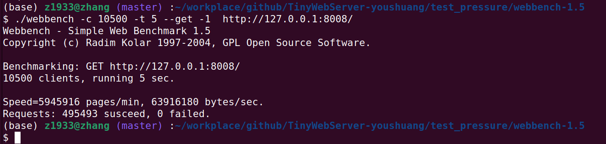
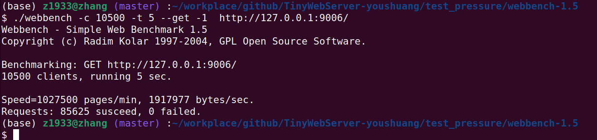

# webserver

基于[chenshuo/muduo](https://github.com/chenshuo/muduo)

与作者的webserver相比，新添功能&特性：
* 支持踢掉空闲连接
* 支持web视频播放、图片展示，使用内存与文件大小无关，只与连接数有关。
* 支持用户登录、注册，提供 Redis API。Redis API 使用 Redis 连接池提供 session 功能，有延迟连接、
后台自动重连功能。
* epoll使用边缘触发，压力测试下发现QPS比水平触发提升了约25%。

## webserver测试：

使用[webbench-1.5](https://github.com/qinguoyi/TinyWebServer/tree/master/test_pressure/webbench-1.5)。

同一台电脑.与[youshuang](https://github.com/qinguoyi/TinyWebServer)的进行比较

* 内存：16G
* CPU: [AMD Ryzen™ 9 7945HX](https://www.amd.com/en/products/processors/laptop/ryzen/7000-series/amd-ryzen-9-7945hx.html)，16核，32线程
* ubuntu22.04 物理机环境
* 线程池大小：16

* 本webserver:



支持每秒9w的请求。

* youshuang



* 原版muduo粗略比较

粗略比较，比较并不公平，因为muduo主页返回的是内存中写死的内容，不用进行文件读写。

```
$ ./webbench -c 10500 -t 5 --get -1  http://127.0.0.1:8000/
Webbench - Simple Web Benchmark 1.5
Copyright (c) Radim Kolar 1997-2004, GPL Open Source Software.

Benchmarking: GET http://127.0.0.1:8000/
10500 clients, running 5 sec.

Speed=4451076 pages/min, 14094922 bytes/sec.
Requests: 370923 susceed, 0 failed.
```

添加的功能并没有降低QPS，吞吐量更大。

# Redis API

基于[sewenew/redis-plus-plus](https://github.com/sewenew/redis-plus-plus)

Lazy conneciton：
1. 线程向连接池申请连接时，加锁,如果发现已申请连接没达到设定的连接池大小，申请新的空连接，尝试用密码连接redis
2. 如果在向连接池申请连接时，发现已申请连接达到设定的连接池大小，连接池中没有连接了，等待其他线程释放连接或坏连接变好。

## 后台自动重连逻辑


1. 在连接池没满时，申请新连接的线程会尝试用密码连接redis，失败时，向重连接事件循环中注册重连接任务，向上抛出异常。
2. 如果连接成功后，发送命令得到redis回复失败，连接可能坏掉了，向重连接事件循环中注册重连接任务，向上抛出异常，表示命令没有执行成功。

* 后台重连接事件循环线程

1. 运行重连接事件循环的线程负责重连，重连成功后，放回连接池。若任然失败，隔$2^1$,$2^2$,,,$2^{10}$秒后自动重试连接。
2. 自动重连接的实现方式为向事件循环中反复注册定时重连接任务，根据失败次数改变定时时间。

用户可用broken_connection_cnt与连接池大小判断可用连接数。

## Redis API

Redis command 发送后，调用redisGetReply库函数返回的redisReply指针（封装成unique_ptr），根据指针所指向的内容判断执行情况。

1. set指令发送后，用redisReply判断返回是否为"OK"
1. get指令发送后, 尝试调用库函数redisGetReply获得执行结果，如果redisReply.type是REDIS_REPLY_ERROR，说明连接出问题，抛出异常,redisReply.str有错误的说明。
    * 如果得到的执行结果是OK，先判断redisReply.type是否为REDIS_REPLY_NIL,如果是,则说明键不存在.然后判断redisReply.type是否为REDIS_REPLY_STRING,如果是说明有返回值,根据redisReply中的str指针获取返回值。


## Redis API内存泄漏检测：

```bash
$ valgrind --tool=memcheck --leak-check=full ./redis_test
==414322== Memcheck, a memory error detector
==414322== Copyright (C) 2002-2024, and GNU GPL'd, by Julian Seward et al.
==414322== Using Valgrind-3.24.0 and LibVEX; rerun with -h for copyright info
==414322== Command: ./redis_test
==414322==
20241123 11:30:32.063688Z 414331 TRACE updateChannel fd = 4 events = 3 index = -1 - EPollPoller.cc:111
20241123 11:30:32.085902Z 414331 TRACE update epoll_ctl op = ADD fd = 4 event = { 4: IN PRI  } - EPollPoller.cc:179
20241123 11:30:32.096996Z 414331 TRACE EventLoop EventLoop created 0x59E1930 in thread 414331 - EventLoop.cc:68
20241123 11:30:32.101292Z 414331 TRACE updateChannel fd = 5 events = 3 index = -1 - EPollPoller.cc:111
20241123 11:30:32.102819Z 414331 TRACE update epoll_ctl op = ADD fd = 5 event = { 5: IN PRI  } - EPollPoller.cc:179
20241123 11:30:32.105740Z 414331 TRACE poll fd total count 2 - EPollPoller.cc:57
try 0
get reply:1234
try 1
get reply:1234
try 2
get reply:1234
last try,sleep 5
try 3
get reply:1234
sleep 1020241123 11:30:37.214869Z 414322 INFO  Test success! - redis_test.cc:43
20241123 11:30:37.237136Z 414331 DEBUG ~EventLoop EventLoop 0x59E1930 of thread 414331 destructs in thread 414331 - EventLoop.cc:85
==414322==
==414322== HEAP SUMMARY:
==414322==     in use at exit: 0 bytes in 0 blocks
==414322==   total heap usage: 164 allocs, 164 frees, 82,361 bytes allocated
==414322==
==414322== All heap blocks were freed -- no leaks are possible
==414322==
==414322== For lists of detected and suppressed errors, rerun with: -s
==414322== ERROR SUMMARY: 0 errors from 0 contexts (suppressed: 0 from 0)
```

# TODO:

* 性能调优

```bash
Samples: 3K of event 'cycles:P', Event count (approx.): 104877547589
  Children      Self  Command          Shared Object         Symbol
+   21.04%     0.00%  httpserver_test  [unknown]             [k] 0xffffffffffffffff
+   14.76%     0.76%  httpserver_test  [kernel.kallsyms]     [k] do_syscall_64
+   14.47%     0.09%  httpserver_test  [kernel.kallsyms]     [k] entry_SYSCALL_64_after_hwframe
+   14.04%     0.13%  httpserver_test  [kernel.kallsyms]     [k] x64_sys_call
+    7.57%     0.00%  httpserver_test  httpserver_test       [.] muduo::Acceptor::handleRead()
+    7.29%     0.04%  httpserver_test  httpserver_test       [.] muduo::TcpServer::newConnection(int, muduo::InetAddress const&)
+    5.95%     0.00%  httpserver_test  httpserver_test       [.] muduo::EventLoop::loop()
+    5.31%     0.06%  httpserver_test  libc.so.6             [.] accept4
+    5.30%     0.00%  httpserver_test  httpserver_test       [.] muduo::Socket::accept(muduo::InetAddress*)
+    5.26%     0.00%  httpserver_test  httpserver_test       [.] muduo::sockets::accept(int, sockaddr_in*)
+    5.24%     0.00%  Thread4          [unknown]             [k] 0xffffffffffffffff
+    5.23%     0.00%  Thread3          [unknown]             [k] 0xffffffffffffffff
+    5.16%     0.00%  Thread8          [unknown]             [k] 0xffffffffffffffff
+    5.16%     0.00%  Thread1          [unknown]             [k] 0xffffffffffffffff
+    5.09%     0.09%  httpserver_test  [kernel.kallsyms]     [k] __sys_accept4
+    5.05%     0.00%  httpserver_test  [kernel.kallsyms]     [k] __x64_sys_accept4
+    4.91%     0.04%  httpserver_test  [kernel.kallsyms]     [k] do_accept
+    4.88%     0.00%  Thread2          [unknown]             [k] 0xffffffffffffffff
+    4.63%     0.00%  Thread4          [kernel.kallsyms]     [k] entry_SYSCALL_64_after_hwframe
+    4.63%     0.00%  Thread4          [kernel.kallsyms]     [k] do_syscall_64
+    4.60%     0.00%  Thread3          [kernel.kallsyms]     [k] entry_SYSCALL_64_after_hwframe
+    4.60%     0.00%  Thread3          [kernel.kallsyms]     [k] do_syscall_64
+    4.57%     0.00%  Thread6          [unknown]             [k] 0xffffffffffffffff
+    4.46%     0.09%  httpserver_test  httpserver_test       [.] muduo::EventLoop::queueInLoop(std::function<void ()> const&)
+    4.41%     0.00%  Thread15         [unknown]             [k] 0xffffffffffffffff
+    4.36%     0.00%  Thread1          [kernel.kallsyms]     [k] entry_SYSCALL_64_after_hwframe
+    4.36%     0.00%  Thread1          [kernel.kallsyms]     [k] do_syscall_64
+    4.35%     0.00%  Thread2          [kernel.kallsyms]     [k] entry_SYSCALL_64_after_hwframe
+    4.35%     0.00%  Thread2          [kernel.kallsyms]     [k] do_syscall_64
+    4.33%     0.00%  Thread1          [kernel.kallsyms]     [k] x64_sys_call
+    4.32%     0.05%  Thread4          [kernel.kallsyms]     [k] x64_sys_call
+    4.28%     0.00%  Thread11         [unknown]             [k] 0xffffffffffffffff
+    4.23%     0.00%  Thread6          [kernel.kallsyms]     [k] entry_SYSCALL_64_after_hwframe
+    4.21%     0.09%  httpserver_test  httpserver_test       [.] muduo::EPollPoller::poll(int, std::vector<muduo::Channel*, std::allocator<muduo
+    4.16%     0.00%  Thread8          [kernel.kallsyms]     [k] entry_SYSCALL_64_after_hwframe
+    4.16%     0.19%  Thread8          [kernel.kallsyms]     [k] do_syscall_64
+    4.16%     0.00%  Thread8          [kernel.kallsyms]     [k] x64_sys_call
+    4.05%     0.00%  Thread6          [kernel.kallsyms]     [k] do_syscall_64
+    3.99%     0.00%  Thread3          [kernel.kallsyms]     [k] x64_sys_call
+    3.96%     0.00%  Thread11         [kernel.kallsyms]     [k] entry_SYSCALL_64_after_hwframe
+    3.96%     0.00%  Thread11         [kernel.kallsyms]     [k] do_syscall_64
```
